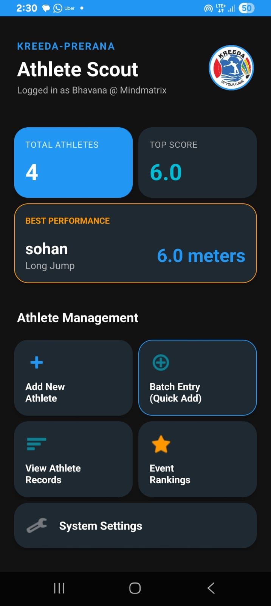
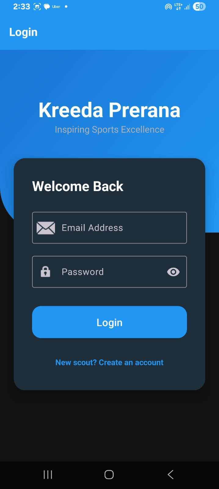
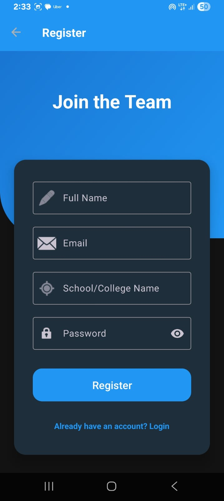

# Kreeda Prerana Scout 🏃‍♂️🏆

Igniting the passion for sports and guiding the next generation of athletes.

*(Kreeda = Sports, Prerana = Inspiration)*

---

## 🎯 Problem Statement

In many schools and colleges, athlete performance records are still managed manually using paper records or spreadsheets. This makes it difficult to track athlete progress, maintain performance history, and identify talented athletes efficiently.

**Kreeda Prerana Scout** solves this problem by providing a digital sports talent tracking platform that helps coaches and teachers manage athlete profiles, record trial performances, generate leaderboards, and analyze athlete improvement through performance analytics.

---

## ✨ Features

### Athlete Profile Management
- Add and manage athlete details
- Store age, gender, height, weight, BMI, and sports category
- Maintain athlete performance history

### Trial Logger System
- Stopwatch-based sprint timing
- Accurate timing up to two decimal places
- Event-wise performance recording

### Leaderboard & Rankings
- Event-based athlete rankings
- Sprint, jump, and throw event categorization
- Automatic performance sorting

### Talent Curve Analytics
- Graphical performance tracking
- Athlete improvement analysis
- Performance insights and analytics

### Batch Athlete Entry
- Add multiple athlete records simultaneously
- Useful for schools and sports camps

### Milestone Badge System
- District Level Ready
- State Level Ready
- National Level Potential
- Automatic badge assignment based on performance

### Dashboard Analytics
- Total athlete statistics
- Best performance tracking
- Quick navigation to application modules

---

## 🛠 Tech Stack

- **Programming Language:** Kotlin
- **Platform:** Android
- **UI Design:** XML Layouts
- **Database:** Room Database
- **Architecture:** MVVM (Model-View-ViewModel)
- **IDE:** Android Studio
- **Charts:** MPAndroidChart
- **Build System:** Gradle

---

## 🚀 Prerequisites & Installation

Before running the project, ensure the following are installed:

- Android Studio (Latest Version Recommended)
- Java Development Kit (JDK 17+)
- Android Emulator or Physical Android Device

### Steps to Run

### Clone the Repository

```bash
git clone https://github.com/06-Bhavana-developer/Kreeda-Prerana-Scout-Sports.git
cd Kreeda-Prerana-Scout-Sports
```

### Open in Android Studio

1. Launch Android Studio
2. Select **File > Open**
3. Choose the project folder
4. Wait for Gradle Sync to complete

---

## ⚙️ How to Build and Run

### Build Debug APK

### Windows

```bash
gradlew.bat assembleDebug
```

### macOS/Linux

```bash
./gradlew assembleDebug
```

Generated APK location:

```bash
app/build/outputs/apk/debug/app-debug.apk
```

---

## 📂 Folder Structure Overview

```bash
Kreeda-Prerana-Scout-Sports/
├── app/
│   ├── src/
│   │   ├── main/
│   │   │   ├── java/com/example/kreeda/
│   │   │   ├── res/
│   │   │   └── AndroidManifest.xml
│   │   ├── test/
│   │   └── androidTest/
│   └── build.gradle.kts
├── gradle/
├── build.gradle.kts
├── settings.gradle.kts
└── README.md
```

---

## 📱 Application Modules

- Dashboard
- Athlete Registration
- Athlete Directory
- Trial Logger
- Leaderboard
- Talent Curve
- Batch Athlete Entry
- Settings

---

## 📱 Application Screenshots

| Dashboard | Athlete Directory |
|------------|------------------|
|  |  |

| Add New Athlete | Batch Athlete Entry |
|-----------------|--------------------|
|  |  |

| Login | Register |
|--------|-----------|
|  |  |

| Talent Curve | Trial List |
|--------------|-------------|
|  |  |

## 🔮 Future Improvements

- Cloud database integration
- Multi-language support
- Real-time coach-athlete communication
- Athlete performance prediction using AI
- Online synchronization and backup
- Export reports in PDF format
- Wearable sports device integration

---

## 📄 License

This project was developed for educational and internship purposes as part of **Android App Development using Generative AI**.
